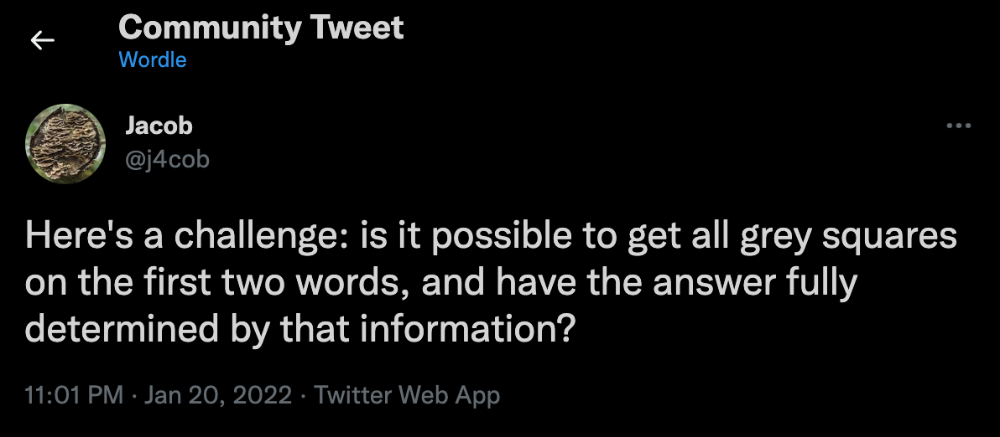

# Wordle Search

Searches [Wordle's](https://www.powerlanguage.co.uk/wordle/) word list for interesting puzzles.

This project was written specifically to answer this [question](https://twitter.com/j4cob/status/1484375558720868355):



The project outputs just some of the first word pair solutions for this problem for all 9 words that fit this scenario.

It can also be used as a basis for answering more questions or setting puzzles from the words.

# Where's the code?

All the good stuff is in one file [here](src/main/kotlin/com/wordle/Search.kt)!

# How to run

```
./gradlew run --quiet
```

# Don't want to run it?

But want to see the output? I've got you covered [here](media/output.txt).

# Editing

Just in case you're interested in this but don't know how to work with a gradle/kotlin project:

To edit the project, open the project in the free [IntelliJ IDEA Community edition](https://www.jetbrains.com/idea/download/).
